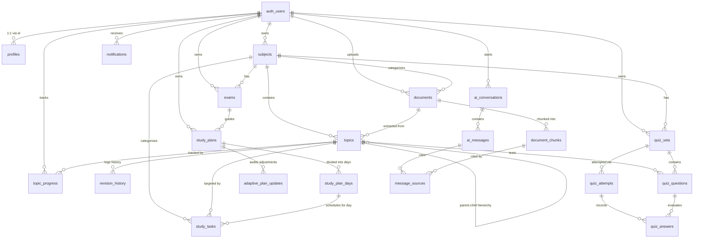

# StudyAgent — Supabase PostgreSQL & pgvector Database Guide 🎓🐬

Comprehensive guide for configuring, migrating, testing, and scaling the Supabase PostgreSQL database architecture for **StudyAgent (Adaptive AI Study & Exam Agent)**.

---

## 📑 Table of Contents

1. [Architectural Overview](#1-architectural-overview)
2. [Database Relationship Diagram (Mermaid)](#2-database-relationship-diagram-mermaid)
3. [Complete Table Directory](#3-complete-table-directory)
4. [pgvector Configuration & RAG Pipeline](#4-pgvector-configuration--rag-pipeline)
5. [Embedding Model & Dimension Selection](#5-embedding-model--dimension-selection)
6. [Vector Similarity Search Function](#6-vector-similarity-search-function)
7. [Row Level Security (RLS) & Multi-Tenant Isolation](#7-row-level-security-rls--multi-tenant-isolation)
8. [Private Supabase Storage Configuration](#8-private-supabase-storage-configuration)
9. [Automated Triggers (User Signup & Timestamps)](#9-automated-triggers-user-signup--timestamps)
10. [Environment Variables](#10-environment-variables)
11. [Step-by-Step Migration Guide](#11-step-by-step-migration-guide)
12. [Seed Development Data](#12-seed-development-data)
13. [Testing & Verification](#13-testing--verification)
14. [Migrating from MongoDB / Mongoose](#14-migrating-from-mongodb--mongoose)

---

## 1. Architectural Overview

StudyAgent utilizes a unified relational database architecture with native vector similarity search powered by Supabase (`PostgreSQL` + `pgvector` + `Row Level Security` + `Storage`).

### Key Workflow:
```
Upload Material (PDF/Notes)
      ↓
Supabase Storage (study-materials bucket, private)
      ↓
documents row (tracking status: uploaded -> extracting -> analyzing -> ready)
      ↓
Text Chunking & Embedding Generation (768-dim)
      ↓
document_chunks (pgvector column with HNSW index)
      ↓
Vector Similarity Search (match_document_chunks RPC)
      ↓
AI Tutor & Diagnostic Quizzes
      ↓
Quiz Evaluation & Weak-Topic Detection (topic_progress status = 'needs_revision')
      ↓
Adaptive Schedule Re-planning (study_plan_days modified + adaptive_plan_updates logged)
      ↓
Dashboard Refresh (Reflects updated mastery and today's tasks)
```

---

## 2. Database Relationship Diagram (Mermaid)



---

## 3. Complete Table Directory

| # | Table Name | Purpose & Contents | Primary Key | Key Foreign Keys |
| :--- | :--- | :--- | :--- | :--- |
| 1 | `profiles` | User profiles, full names, avatars, daily available study hours | `UUID (references auth.users)` | `id -> auth.users(id)` |
| 2 | `subjects` | Courses/subjects (TOC, DBMS, OS, CN, DSA) with theme color | `UUID` | `user_id -> auth.users(id)` |
| 3 | `exams` | Upcoming exams and target dates for sprint planning | `UUID` | `user_id`, `subject_id` |
| 4 | `documents` | Uploaded notes/PDFs metadata and extraction pipeline status | `UUID` | `user_id`, `subject_id` |
| 5 | `document_chunks` | **Core RAG table**: Chunks, metadata, page numbers, `VECTOR(768)` | `UUID` | `document_id`, `user_id`, `subject_id` |
| 6 | `topics` | Syllabus hierarchy: Unit → Chapter → Topic → Subtopic | `UUID` | `subject_id`, `document_id`, `parent_topic_id` |
| 7 | `study_plans` | Multi-day study schedules generated by the Planner Agent | `UUID` | `user_id`, `exam_id` |
| 8 | `study_plan_days` | Day-by-day roadmap (Days 1–10) with status: upcoming, active, completed, adaptive | `UUID` | `study_plan_id` |
| 9 | `study_tasks` | Actionable daily study checklist ("Today's Tasks" card) | `UUID` | `study_plan_day_id`, `user_id`, `subject_id`, `topic_id` |
| 10 | `quiz_sets` | Generated quizzes with title, difficulty, and question count | `UUID` | `user_id`, `subject_id`, `topic_id` |
| 11 | `quiz_questions` | MCQs, question text, options JSONB, `correct_answer`, explanations | `UUID` | `quiz_set_id`, `topic_id` |
| 12 | `quiz_attempts` | Recorded exam scores, percentages, and timestamps | `UUID` | `user_id`, `quiz_set_id` |
| 13 | `quiz_answers` | Student answer submissions and evaluation results | `UUID` | `attempt_id`, `question_id`, `topic_id` |
| 14 | `topic_progress` | Mastery % (0–100), attempt count, status (`needs_revision`, `mastered`) | `UUID` | `user_id`, `topic_id` (UNIQUE constraint) |
| 15 | `revision_history` | Audit trail of mastery score adjustments and reasons | `UUID` | `user_id`, `topic_id` |
| 16 | `adaptive_plan_updates` | Records WHY the agent restructured future study days | `UUID` | `user_id`, `study_plan_id` |
| 17 | `ai_conversations` | Threaded chat sessions with the AI Study Tutor | `UUID` | `user_id` |
| 18 | `ai_messages` | User queries and AI Tutor responses with grounded citations | `UUID` | `conversation_id`, `user_id` |
| 19 | `message_sources` | Citations linking AI responses to specific document chunks | `UUID` | `message_id`, `document_chunk_id` |
| 20 | `notifications` | In-app alerts, quiz evaluations, and adaptive plan updates | `UUID` | `user_id` |

---

## 4. pgvector Configuration & RAG Pipeline

pgvector is enabled via:
```sql
CREATE EXTENSION IF NOT EXISTS vector;
```

The table `document_chunks` contains the vector embedding column:
```sql
embedding VECTOR(768)
```

### Vector Index (HNSW)
We utilize an **HNSW (Hierarchical Navigable Small World)** index with cosine distance operators (`vector_cosine_ops`):
```sql
CREATE INDEX idx_document_chunks_embedding_hnsw
ON public.document_chunks
USING hnsw (embedding vector_cosine_ops)
WITH (m = 16, ef_construction = 64);
```
- `m = 16`: Number of bi-directional links created per node.
- `ef_construction = 64`: Size of the dynamic candidate list evaluated during index construction.

---

## 5. Embedding Model & Dimension Selection

### Selected Dimension: `vector(768)`

**Why 768 dimensions?**
1. **Frontend Contract**: In `src/components/Modals/UploadModal.jsx` (lines 169–170), the ingestion pipeline explicitly displays:
   `"Generating 768-dim embeddings for RAG retrieval"`
2. **Google Gemini Compatibility**: Google's primary embedding model (`text-embedding-004`) generates native **768-dimension vectors**.
3. **OpenAI Compatibility**: OpenAI's `text-embedding-3-small` natively supports dimension reduction via `{ dimensions: 768 }`, delivering near-identical retrieval accuracy at 50% lower memory and indexing cost.

### Switching to Uncompressed OpenAI (1536 Dimensions)
If you wish to use OpenAI `text-embedding-3-small` without dimension reduction (1536 dimensions):
1. In `supabase/migrations/002_pgvector.sql` and `all_in_one_migration.sql`, change:
   ```sql
   embedding VECTOR(768)
   -- to:
   embedding VECTOR(1536)
   ```
2. In `supabase/migrations/005_functions_indexes.sql`, change the function parameter:
   ```sql
   query_embedding vector(768)
   -- to:
   query_embedding vector(1536)
   ```
3. Update `.env`:
   ```env
   EMBEDDING_DIMENSION=1536
   ```

---

## 6. Vector Similarity Search Function

Similarity search is implemented in PostgreSQL via the `match_document_chunks` RPC:

```sql
CREATE OR REPLACE FUNCTION public.match_document_chunks(
    query_embedding vector(768),
    match_threshold float DEFAULT 0.5,
    match_count int DEFAULT 5,
    filter_user_id uuid DEFAULT NULL,
    filter_subject_id uuid DEFAULT NULL
)
RETURNS TABLE (
    id UUID,
    document_id UUID,
    chunk_index INTEGER,
    content TEXT,
    page_number INTEGER,
    metadata JSONB,
    similarity FLOAT
)
LANGUAGE plpgsql
SECURITY DEFINER
SET search_path = public, extensions
AS $$
DECLARE
    effective_user_id UUID;
BEGIN
    -- Strict Multi-Tenant Isolation
    effective_user_id := COALESCE(auth.uid(), filter_user_id);
    IF effective_user_id IS NULL THEN
        RAISE EXCEPTION 'Unauthorized: User identification required for vector search.';
    END IF;

    RETURN QUERY
    SELECT
        dc.id,
        dc.document_id,
        dc.chunk_index,
        dc.content,
        dc.page_number,
        dc.metadata,
        (1 - (dc.embedding <=> query_embedding))::FLOAT AS similarity
    FROM public.document_chunks dc
    WHERE dc.user_id = effective_user_id
      AND (filter_subject_id IS NULL OR dc.subject_id = filter_subject_id)
      AND (1 - (dc.embedding <=> query_embedding)) >= match_threshold
    ORDER BY dc.embedding <=> query_embedding ASC
    LIMIT match_count;
END;
$$;
```

### Security Guarantee:
- Uses `1 - (embedding <=> query_embedding)` to compute cosine similarity.
- **Never leaks vectors across users**: `effective_user_id := COALESCE(auth.uid(), filter_user_id)`. If an unauthenticated client calls the function, execution fails immediately.

---

## 7. Row Level Security (RLS) & Multi-Tenant Isolation

RLS is enabled on **every single table** in the schema:

1. **Direct User-Owned Tables**:
   - `profiles`, `subjects`, `exams`, `documents`, `document_chunks`, `topics`, `study_plans`, `study_tasks`, `quiz_sets`, `quiz_attempts`, `topic_progress`, `revision_history`, `adaptive_plan_updates`, `ai_conversations`, `ai_messages`, `notifications`.
   - Rule: `USING (auth.uid() = user_id)`
2. **Child Relational Tables**:
   - `study_plan_days`: Scoped through `EXISTS (SELECT 1 FROM study_plans sp WHERE sp.id = study_plan_days.study_plan_id AND sp.user_id = auth.uid())`
   - `quiz_questions`: Scoped through `quiz_sets(user_id)`
   - `quiz_answers`: Scoped through `quiz_attempts(user_id)`
   - `message_sources`: Scoped through `ai_messages(user_id)`
3. **Quiz Answer Protection**:
   - The test-taking API route (`GET /api/quiz/:id/take`) strips `correct_answer` and `explanation` from responses sent to students. The student submits answers to the server, where the backend grades against `quiz_questions.correct_answer`.

---

## 8. Private Supabase Storage Configuration

### Bucket Name: `study-materials`
- **Access**: Private (`public = FALSE`)
- **File Limit**: 50 MB
- **Allowed MIME types**: `application/pdf`, `application/vnd.openxmlformats-officedocument.wordprocessingml.document`, `text/plain`, `image/png`, `image/jpeg`
- **File Path Structure**:
  ```
  <user_id>/<document_id>/<file_name>.pdf
  ```

### Storage RLS Policies:
Strictly verifies that the first folder in the object path matches the authenticated user's UUID:
```sql
CREATE POLICY "Allow authenticated uploads to user folder"
ON storage.objects FOR INSERT TO authenticated
WITH CHECK (
    bucket_id = 'study-materials' 
    AND (storage.foldername(name))[1] = auth.uid()::text
);
```

---

## 9. Automated Triggers (User Signup & Timestamps)

1. **Automatic Profile Creation**:
   When a user signs up via Supabase Auth (`auth.users`), the `handle_new_user()` trigger automatically provisions their row in `public.profiles` with name, avatar, and default 2.0 study hours.
2. **Automatic `updated_at` Refresh**:
   Attached to `profiles`, `subjects`, `exams`, `documents`, `topics`, `study_plans`, `study_plan_days`, `study_tasks`, `topic_progress`, and `ai_conversations`.

---

## 10. Environment Variables

Create `.env` in the root and in `server/`:

```env
# ------------------------------------------------------------------------------
# FRONTEND VARIABLES (Vite / React)
# Safe for client bundle. Never expose service-role key!
# ------------------------------------------------------------------------------
VITE_SUPABASE_URL=https://your-project.supabase.co
VITE_SUPABASE_ANON_KEY=eyJhbGciOiJIUzI1NiIsInR5cCI6IkpXVCJ9...
VITE_AGENT_API_URL=http://localhost:5000/api

# ------------------------------------------------------------------------------
# BACKEND SERVER-ONLY VARIABLES (Node / Express)
# Keep strictly confidential!
# ------------------------------------------------------------------------------
PORT=5000
SUPABASE_URL=https://your-project.supabase.co
SUPABASE_ANON_KEY=eyJhbGciOiJIUzI1NiIsInR5cCI6IkpXVCJ9...
SUPABASE_SERVICE_ROLE_KEY=eyJhbGciOiJIUzI1NiIsInR5cCI6IkpXVCJ9...

# AI & Embeddings
GEMINI_API_KEY=AIzaSy...
EMBEDDING_MODEL=text-embedding-004
EMBEDDING_DIMENSION=768
```

---

## 11. Step-by-Step Migration Guide

### Option A: One-Click Migration via Supabase Web Dashboard (Fastest)
1. Open your project on [database.new](https://database.new) or the [Supabase Dashboard](https://supabase.com/dashboard).
2. Navigate to **SQL Editor** (left sidebar).
3. Click **New Query**.
4. Open [supabase/migrations/all_in_one_migration.sql](file:///c:/Users/KHATRI%20OM%20KUMAR/Desktop/AI-PROJECT/supabase/migrations/all_in_one_migration.sql), copy its entire contents, paste into the editor, and click **Run**.
5. All 20 tables, pgvector extension, HNSW indexes, RLS policies, storage bucket, and search functions will be created instantly.

### Option B: Modular Migrations via Supabase CLI
```bash
# 1. Login to Supabase CLI
supabase login

# 2. Link your remote project
supabase link --project-ref your-project-ref

# 3. Push migrations in sequence
supabase db push
```

Migration files available:
- `supabase/migrations/001_initial_schema.sql`
- `supabase/migrations/002_pgvector.sql`
- `supabase/migrations/003_rls_policies.sql`
- `supabase/migrations/004_storage.sql`
- `supabase/migrations/005_functions_indexes.sql`

---

## 12. Seed Development Data

After you create or sign up at least one test student in your Supabase Auth dashboard:
1. In the Supabase **SQL Editor**, open [supabase/seed.sql](file:///c:/Users/KHATRI%20OM%20KUMAR/Desktop/AI-PROJECT/supabase/seed.sql).
2. Click **Run**.
3. It will populate realistic Theory of Computation (TOC) and DBMS demo data:
   - Subjects & Exams
   - 3 Uploaded PDFs
   - Topic hierarchy (Units 1–4, DFA, NFA, Regular Expressions, Pumping Lemma, CFG, PDA, Turing Machines)
   - 10-Day Adaptive Study Plan with Day 4 in-progress and Day 9 adapted
   - Today's tasks (matched to dashboard)
   - Diagnostic Quiz set, questions, and attempt showing 45% score on Unit 2
   - Topic progress highlighting weak areas (`needs_revision`)
   - Audit trail in `adaptive_plan_updates`

---

## 13. Testing & Verification

We have included an automated test script to verify your setup:

```bash
# 1. Navigate to server folder and install dependencies
cd server
npm install

# 2. Run the database verification suite
npm run test:db
```

The script verifies:
1. All 20 core tables are queryable.
2. The private `study-materials` storage bucket is present.
3. The `match_document_chunks` pgvector function runs cleanly.
4. The `get_student_dashboard_summary` aggregator returns dashboard metrics.
5. Row Level Security correctly blocks unauthenticated / cross-user queries.

---

## 14. Migrating from MongoDB / Mongoose

If your project or previous assignments used MongoDB / Mongoose (such as the schema patterns in `Desktop/RELATIONSHIP/Models`):

| MongoDB / Mongoose Pattern | Supabase PostgreSQL Equivalent |
| :--- | :--- |
| `_id: mongoose.Schema.Types.ObjectId` | `id UUID PRIMARY KEY DEFAULT gen_random_uuid()` |
| `ref: "Order"` with `.populate("orders")` | `subject_id UUID REFERENCES subjects(id)` + `.select('*, subjects(*)')` |
| Subdocument arrays `orders: [{ item, price }]` | Normalized child table `study_tasks` or `JSONB` column |
| Mongoose hooks (`schema.pre('save')`) | PostgreSQL triggers (`BEFORE UPDATE EXECUTE FUNCTION set_updated_at()`) |
| Atlas `$vectorSearch` aggregation | Native pgvector `match_document_chunks(...)` RPC |
| Manual user ID checks in Express | Kernel-level Row Level Security (`auth.uid() = user_id`) |

Review [server/src/migration/mongooseToSupabase.js](file:///c:/Users/KHATRI%20OM%20KUMAR/Desktop/AI-PROJECT/server/src/migration/mongooseToSupabase.js) for drop-in query replacements for all 16 core operations.
